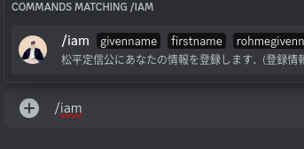
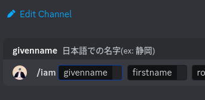
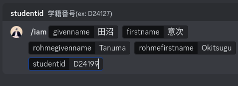
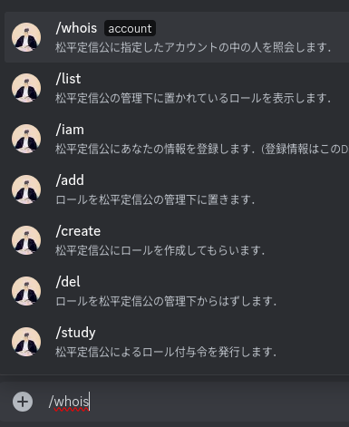
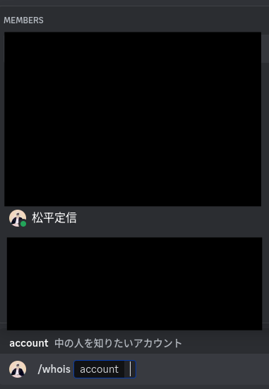

# D1 BOT
こんにちは。沼津高専 電子制御工学科 1年 (D1) Discord Serverで動くbotです。
permission-matsudaira: 1084949411904
https://discord.com/api/oauth2/authorize?client_id=123456789012345678&permissions=1084949411904&scope=bot%20applications.commands

permission-lincoln: 397351795792
https://discord.com/api/oauth2/authorize?client_id=123456789012345678&permissions=397351795792&scope=bot%20applications.commands

## 松平定信botへの情報登録方法
まずは「/iam」とメッセージ欄に入力します． 
 
表示されたiamコマンドをクリックまたはタップします． 
 
説明のとおり
- 「givename」はあなたの日本語での名字
- 「firstname」はあなたの日本語での下の名前
- 「rohmegivename」はあなたのローマ字表記の名字
- 「rohmefirstname」はあなたのローマ字表記の名字
- 「studentId」はあなたの学籍番号

なお学籍番号について，入力したく場合は暫定的にX99999と登録できますが，今後参加者認証を行うことになった時に不具合を起こす可能性があるのでなるべく自分の学籍番号を入力してください．

入力例 

## 松平定信botへの情報照会方法
まずは「/whois」とメッセージ欄に入力します． 

表示されたwhoisコマンドをクリックまたはタップします． 
 