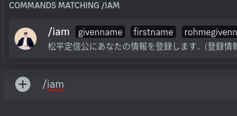
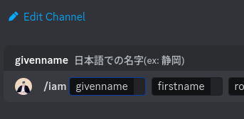
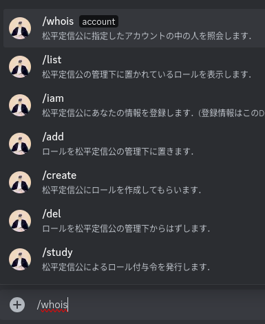
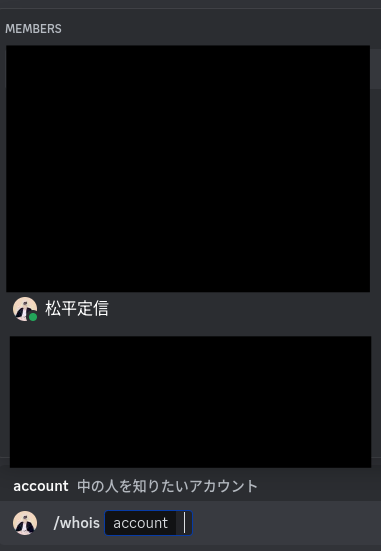
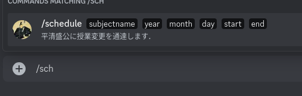
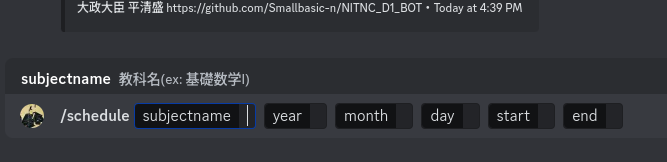
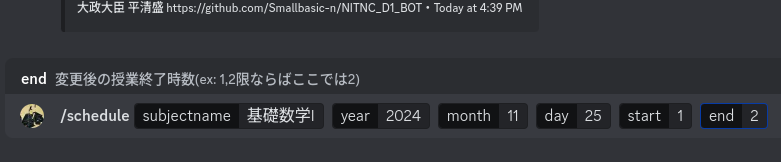

# D1 BOT
こんにちは。沼津高専 電子制御工学科 1年 (D1) Discord Serverで動くbotです。

- ## 松平定信
  - ## 存在意義
    このbotは，みなさまのアカウント名と，**実際の中の人の情報とを結びつける**役割があります．確かに，サーバプロファイルで名前を替えればよい気はします．しかし，**アカウント名もその人の個性**のうち．それを含めて，自由なサーバにしたいと考えた結果，このような方式をとることとしました． 
    ここでは，**自分の名前**(日本語・ローマ字表記で)を登録してもらいます．できれば**学籍番号**も登録してほしいです．
  - ## 松平定信botへの情報登録方法
    まずは[自己紹介チャネル](https://discord.com/channels/1301170258329075724/1301422627050491984)(このリンクから開けます)を開き，「***/iam***」とメッセージ欄に入力します． 
     
    表示された ***iamコマンド*** をクリックまたはタップします． 
     
    説明のとおり
    - 「givename」はあなたの**日本語での名字**
    - 「firstname」はあなたの**日本語での下の名前**
    - 「rohmegivename」はあなたの**ローマ字表記の名字**
    - 「rohmefirstname」はあなたの**ローマ字表記の下の名前**
    - 「studentId」はあなたの**学籍番号**

    なお学籍番号について，入力したく場合は暫定的にX99999と登録できますが，今後参加者認証を行うことになった時に不具合を起こす可能性があるのでなるべく自分の学籍番号を入力してください．

    入力例 
    

  - ## 松平定信botへの情報照会方法
    まずは「***/whois***」とメッセージ欄に入力します． 
    
    表示された ***whoisコマンド*** をクリックまたはタップします． 
     
    ***account***に中の人を知りたいアカウントを入力します．
- ## 平清盛
  - ## 存在意義
    このbotは，教員も社会を生きる人間ですから，ある先生のように用事があったり，ある先生のように**授業を忘れたり**することがあります．
    また，**課題を詰め込む**先生もいます．そこでそれらに惑わされないようにするのがこのbotです．主な機能として，授業変更の登録，宿題の登録ができます．
    基本的に、課題や授業変更が登録された時，締切・実施前日20時，締切・実施日朝6時に課題・授業変更情報を送信します．
  - ## 平清盛への**授業変更**登録方法
    まずは[課題・授業変更チャネル](https://discord.com/channels/1301170258329075724/1321800840033599538) (このリンクから開けます．)を開き，「***/schedule***」とメッセージ欄に入力します． 
     
    表示された ***scheduleコマンド*** をクリックまたはタップします． 
     
    説明のとおり
    - 「subjectname」は**教科名**
    - 「year」はあなたの**実施される年** 例：2024, 2025
    - 「month」はあなたの**実施される月**　例： 6, 11
    - 「day」はあなたの**実施される日** 例： 10, 15
    - 「start」と「end」は**開始時限**と**終了時限** 例： 1コマ目なら「1, 2」 2コマ目なら「3, 4」 工学基礎Iのような授業の場合は　「2, 2」
    
    入力例  
    
  - ## 平清盛への**課題**登録方法
      coming soon...